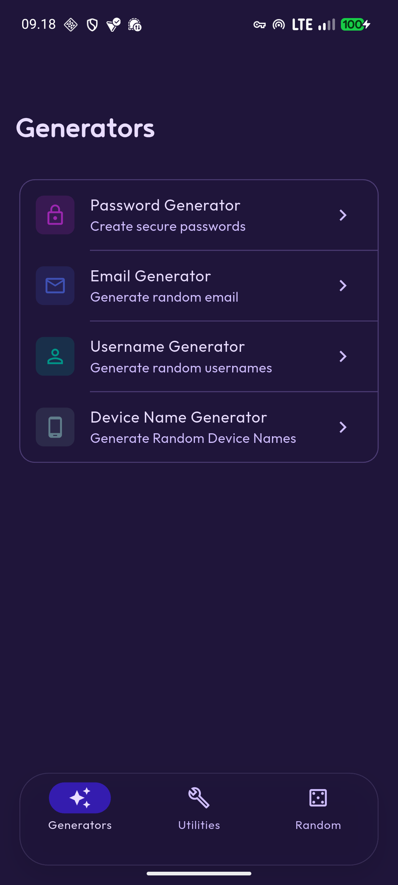
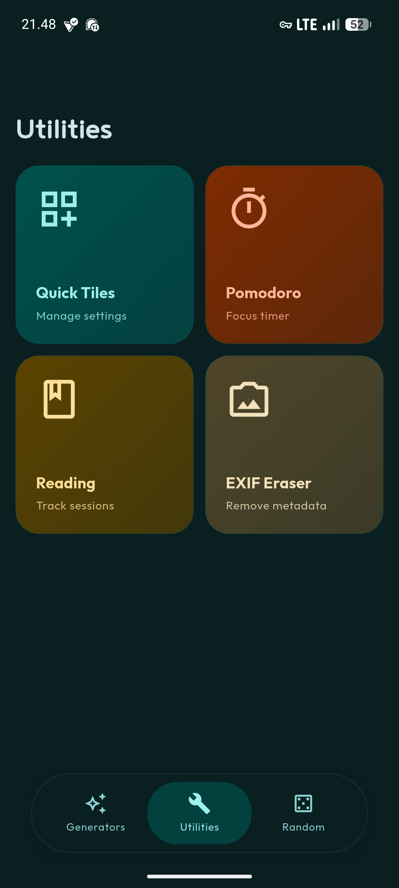
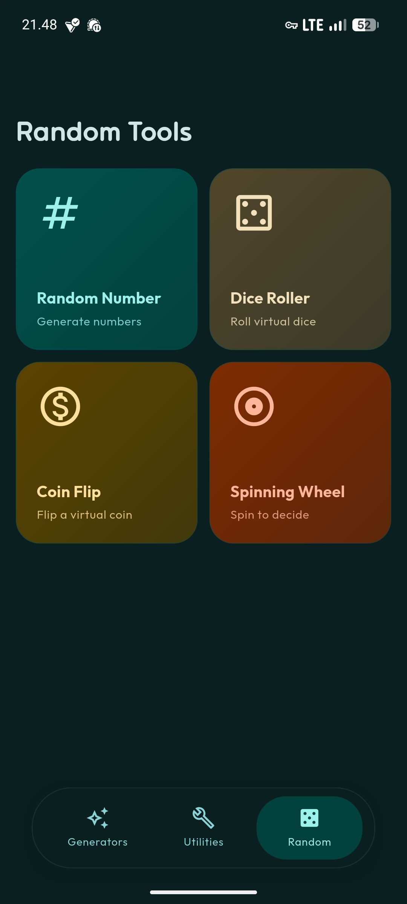

# **Random**
*A privacy-focused utility app for generating secure passwords, random identities, fake data, and more—built with Flutter. Perfect for testing, development, and maintaining your privacy online.*

*This app i create for my personal use, and i kinda create it for like an all-in-one app for random stuffs, so i don't know if it gonna be useful for you, but if it is, you can use it :)*

[](https://github.com/felle-dev/random-app/releases)
[](https://flutter.dev)
[](LICENSE)

[](https://github.com/felle-dev/random-app/releases)
[](https://github.com/felle-dev/random-app/releases)
[](https://github.com/felle-dev/random-app/releases)
[](https://github.com/felle-dev/random-app/releases)
[](https://github.com/felle-dev/random-app/releases)

[](https://github.com/felle-dev/random-app/releases)

## **Why Random?**
- **Privacy First** – All operations happen locally on your device
- **No Accounts** – No sign-ups, no registration, just install and use
- **Lightweight** – Small app size, minimal permissions
- **Cross-Platform** – Works on Android, iOS, Windows, Linux, and macOS
- **100% Offline** – No internet required; your data never leaves your device

## **Features**

### **Generators**
- **Password Generator** – Create strong, customizable passwords with various options
- **Email Generator** – Generate random email addresses for testing
- **Username Generator** – Create unique usernames instantly
- **Phone Generator** – Generate fake phone numbers
- **Device Name Generator** – Random device names for privacy
- **Identity Generator** – Complete fake identities for testing forms

### **Random Tools**
- **Random Number** – Generate random numbers in any range
- **Dice Roller** – Roll virtual dice for games or decisions
- **Coin Flip** – Flip a virtual coin for random choices
- **Spinning Wheel** – Spin to decide between options

### **Utilities**
- **EXIF Eraser** – Remove metadata from photos to protect your privacy
- **Quick Tiles** – Add tile for screenshot, media volume, lock screen and screen timeout
- **Unit Converter** – Convert between different units
- **Device Info** – View detailed device and battery information

## **Screenshots**
<div style="display: flex; justify-content: space-around; gap: 10px;">
  
  
  
</div>

## **Tech Stack**
- **Language:** Dart
- **Framework:** Flutter
- **UI:** Material Design 3
- **Architecture:** Privacy-first, offline-capable design
- **Platforms:** Android, iOS, Windows, Linux, macOS

## **Getting Started**

### **Prerequisites**
- [Flutter SDK](https://flutter.dev/docs/get-started/install) (latest stable version)
- Android Studio / VS Code with Flutter extensions
- Android/iOS device or emulator (or Windows/Linux/macOS for desktop)

### **Installation**
1. Clone the repository:
   ```bash
   git clone https://github.com/felle-dev/random-app.git
   cd random-app
   ```

2. Install dependencies:
   ```bash
   flutter pub get
   ```

3. Run the app:
   ```bash
   # For mobile
   flutter run
   
   # For specific platforms
   flutter run -d windows
   flutter run -d macos
   flutter run -d linux
   ```

### **Build Release**
```bash
# Android APK
flutter build apk --release

# Android App Bundle
flutter build appbundle --release

# iOS
flutter build ios --release

# Windows
flutter build windows --release

# macOS
flutter build macos --release

# Linux
flutter build linux --release
```
## **Privacy & Security**
- **No Data Collection** – We don't collect, store, or transmit any user data
- **No Analytics** – Zero tracking, no telemetry
- **No Internet Required** – All features work completely offline
- **No Permissions Abuse** – Only essential permissions requested
- **Open Source** – Fully transparent and auditable code
- **Local Processing** – Everything runs on your device

## **Contributing**
Open-source thrives on collaboration! You can:
- Fork the project and submit pull requests
- Report bugs or suggest features via [issues](https://github.com/felle-dev/random-app/issues)
- Share feedback or ideas
- Improve documentation
- Help with translations

### **How to Contribute**
1. Fork the repository
2. Create your feature branch (`git checkout -b feature/AmazingFeature`)
3. Commit your changes (`git commit -m 'Add some AmazingFeature'`)
4. Push to the branch (`git push origin feature/AmazingFeature`)
5. Open a Pull Request

## **License**
This project is licensed under the **GNU General Public License v3.0**. See [LICENSE](LICENSE) for more details.

